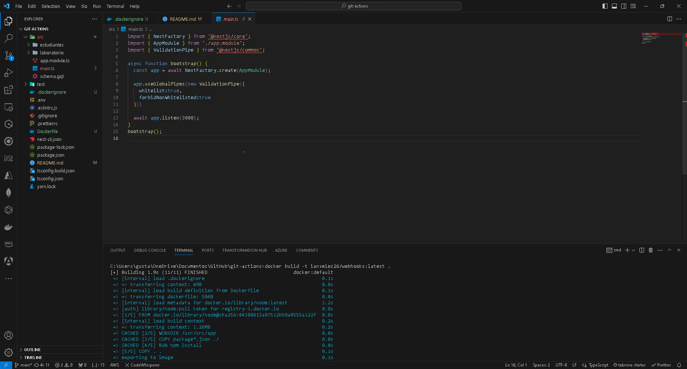
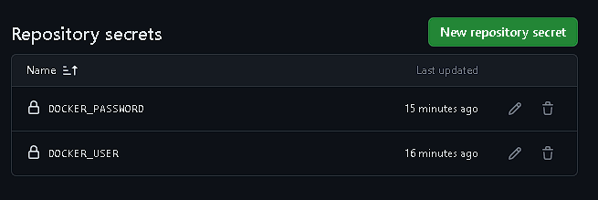
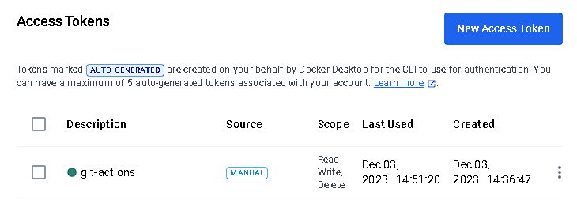
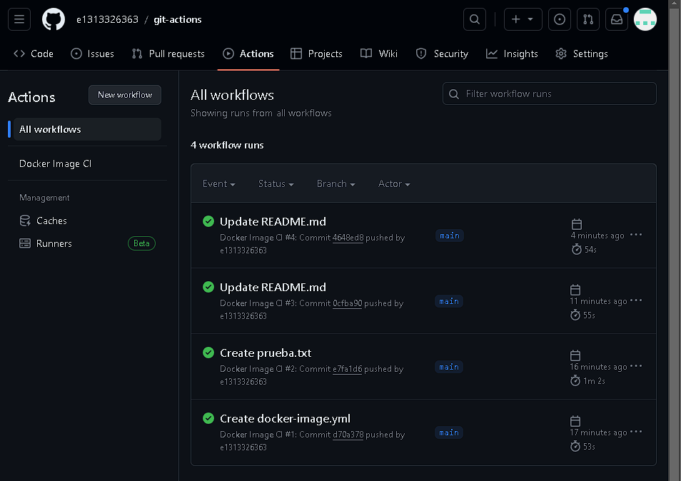
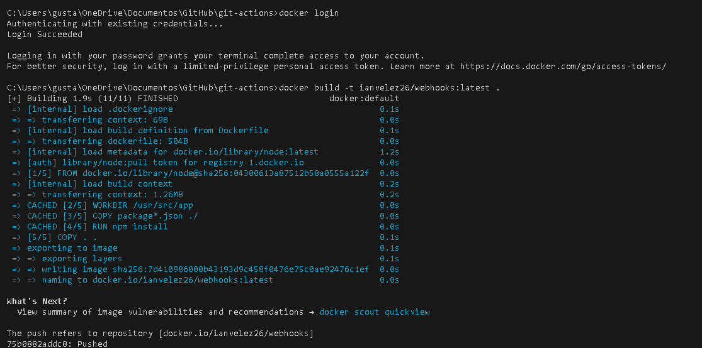
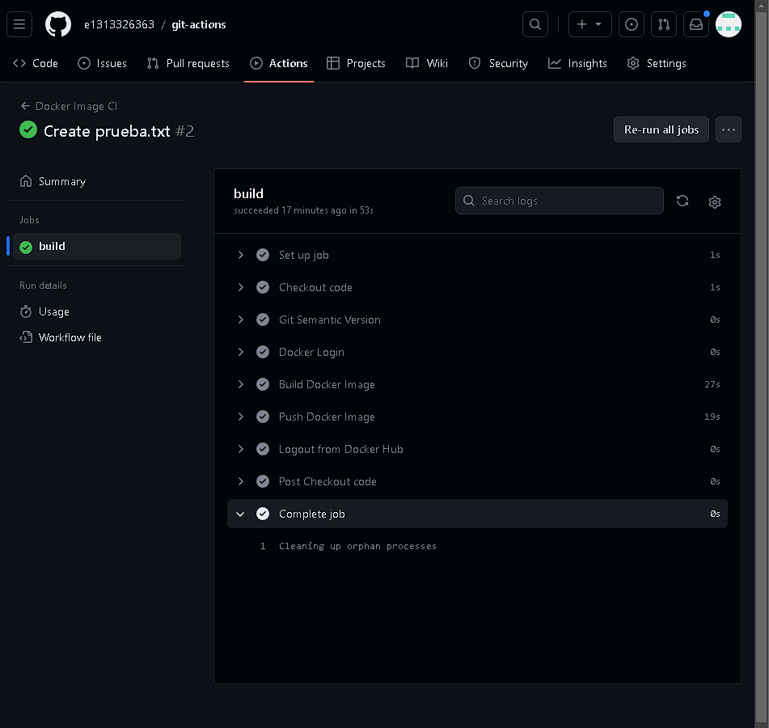

# Dockerización de Aplicación NestJS y GitHub Actions

# LINK DEL REPO DONDE SE REALIZO LA PRACTICA:
# https://github.com/e1313326363/git-actions 

## Descripción
Este repositorio demuestra cómo Dockerizar una aplicación NestJS y configurar un flujo de trabajo en GitHub Actions para construir y desplegar contenedores de Docker.

## Pasos por seguir

### 1. Crear Repositorio

Crea un repositorio público o privado en GitHub. [Enlace al Repositorio](https://github.com/gusrsl/webhooks)

### 2. Preparar el Código Fuente

git init
git add .
git commit -m "Primer commit con el código fuente"
3. Subir Código al Repositorio
bash
Copy code
git remote add origin https://github.com/gusrsl/webhooks.git
git branch -M main
git push -u origin main

### 4. Configurar Secrets en GitHub

Crea los secrets DOCKER_USER y DOCKER_PASSWORD en la sección de Secrets de tu repositorio en GitHub.

### 5. Configurar Token de Docker Hub

Utiliza tu usuario y clave (token) de Docker Hub para llenar los secrets DOCKER_USER y DOCKER_PASSWORD.
Crea un Token en Docker (con el nombre Github-Actions) y copia este Token generado en el secret DOCKER_PASSWORD.

### 6. Crear Action Docker Image
Configura un flujo de trabajo en GitHub Actions para generar la imagen Docker utilizando el archivo docker-image.yml.

#### 7. Dockerizar la Aplicación

Dockeriza tu aplicación NestJS (preferiblemente un servicio REST o GraphQL sin dependencias).

#### 8. Verificar Construcción y Funcionamiento

Asegúrate de que la imagen puede ser compilada con el siguiente comando:
bash
Copy code
docker build -t gusrsl/webhooks:0.0.1 .
Verifica el funcionamiento de la aplicación.

# Evidencias

  1. Preparación del Código Fuente
      

  2. Configuración de Secrets en GitHub
      

  3. Configuración del Token de Docker Hub
      

  4. Creación de la Action Docker Image
      

  5. Dockerización de la Aplicación
      

  6. Verificación de la Construcción y Funcionamiento
      
